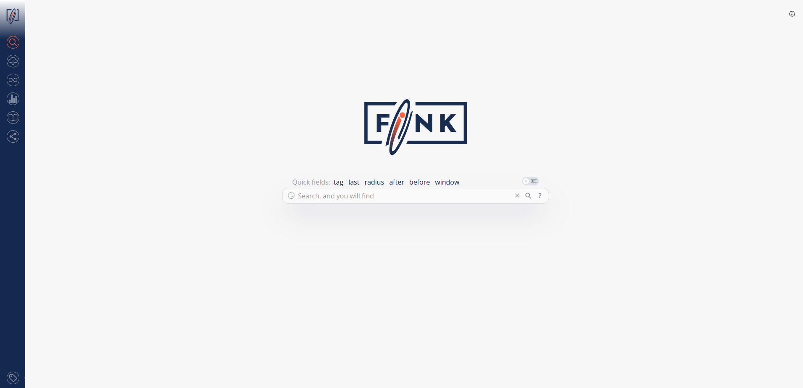

# Fink Science Portal



The Fink/LSST Science Portal allows users to browse and display alert data generated by LSST and collected and processed by Fink, from a web browser: [https://lsst.fink-portal.org](https://lsst.fink-portal.org).

The backend is using [Apache HBase](https://hbase.apache.org/), a distributed non-relational database. The frontend is based on [Dash](https://plotly.com/dash/), a Python web framework built on top of Flask, Plotly and React. The frontend has also integrated components to perform fit on the data, such as [nifty-ls](https://github.com/flatironinstitute/nifty-ls) for variable stars, or the [imcce](https://ssp.imcce.fr/webservices/miriade/) tools for Solar System objects.

After each observation night, the data is aggregated and pushed into large Apache HBase tables. We developed custom HBase clients to manipulate the data efficiently (Lomikel, FinkBrowser, more information [here](https://hrivnac.web.cern.ch/hrivnac/Activities/index.html)).

## Local deployment

The portal has been tested on Python 3.9 to 3.12. Other versions might work. First you need to install the Python dependencies:

```bash
python -m venv portal_env
source portal_env/bin/activate

pip install -r requirements.txt
```

The default configuration file (`config.yml`) should be enough to deploy, so just execute:

```bash
python index.py
```

and navigate to [http://localhost:24000/](http://localhost:24000/).

### Telemetry

You can easily turn telemetry on to inspect the site performance. Just define `export DASH_TELEMETRY=1` and restart the application. Now whenever you do an action, you will see similar log in your terminal:

```bash
[TELEMETRY] __main__:display_page, 0.0003s
___input:|url.pathname:/|
___state:||
__output:|{'id': 'page-content', 'property': 'children'}.children:(Div([Container(chil|
[TELEMETRY] __main__:change_color, 0.0001s
___input:|url.pathname:/|
___state:||
__output:|{'id': 'navbar_button_/', 'property': 'color'}.color:#F5622E||{'id': 'navbar_button_/download', 'property': 'color'}.color:gray||{'id': 'navbar_button_/gw', 'property': 'color'}.color:gray||{'id': 'navbar_button_/stats', 'property': 'color'}.color:gray||{'id': 'navbar_button_/schemas', 'property': 'color'}.color:gray|
[TELEMETRY] __main__:make_radiocard, 0.0002s
___input:|color_scale.value:Fink|
___state:||
__output:|color_palette.children:Group(children=[Acti|
[TELEMETRY] searchbar:update_search_history_menu, 0.0000s
___input:|search_history_store.timestamp:None||search_history_store.data:None|
___state:||
__output:|search_history_menu.children:<dash._callback.NoUp|
[TELEMETRY] searchbar:update_suggestions, 0.0000s
___input:|search_bar_input.n_submit:1||search_bar_submit.n_clicks:0|
___state:|search_bar_input.value:tag=extragalactic_lt|
__output:|{'id': 'search_bar_suggestions', 'property': 'children'}.children:(<dash._callback.NoU|
[TELEMETRY] search_results:results, 0.3799s
___input:|search_bar_input.n_submit:1||search_bar_submit.n_clicks:0||url.search:|
___state:|search_bar_input.value:tag=extragalactic_lt||search_history_store.data:None||results_table_switch.checked:False|
__output:|{'id': 'results', 'property': 'children'}.children:([Row(children=[Col(|
```

## Cloud deployment

The procedure for developpers and maintainers can be found on the [Fink GitLab](https://gitlab.in2p3.fr/fink/rubin-performance-check/-/blob/main/portal/README.md?ref_type=heads) repository (auth required).
